##Writeup Template
###You can use this file as a template for your writeup if you want to submit it as a markdown file, but feel free to use some other method and submit a pdf if you prefer.

---

**Vehicle Detection Project**

The goals / steps of this project are the following:

* Perform a Histogram of Oriented Gradients (HOG) feature extraction on a labeled training set of images and train a classifier Linear SVM classifier
* Optionally, you can also apply a color transform and append binned color features, as well as histograms of color, to your HOG feature vector. 
* Note: for those first two steps don't forget to normalize your features and randomize a selection for training and testing.
* Implement a sliding-window technique and use your trained classifier to search for vehicles in images.
* Run your pipeline on a video stream (start with the test_video.mp4 and later implement on full project_video.mp4) and create a heat map of recurring detections frame by frame to reject outliers and follow detected vehicles.
* Estimate a bounding box for vehicles detected.

## [Rubric](https://review.udacity.com/#!/rubrics/513/view) Points
###Here I will consider the rubric points individually and describe how I addressed each point in my implementation.  

---
###Writeup / README

####1. Provide a Writeup / README that includes all the rubric points and how you addressed each one.  You can submit your writeup as markdown or pdf.  [Here](https://github.com/udacity/CarND-Vehicle-Detection/blob/master/writeup_template.md) is a template writeup for this project you can use as a guide and a starting point.  

You're reading it!

###Histogram of Oriented Gradients (HOG)

####1. Explain how (and identify where in your code) you extracted HOG features from the training images.

The code for this step is contained in the third code cell of the file called `submit_version_final.py`.  

I started by reading in all the `vehicle` and `non-vehicle` images.  Here is an example of one of each of the `vehicle` and `non-vehicle` classes:

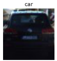
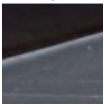

I try different parameters (`orientations`, `pixels_per_cell`, and `cells_per_block`).  I grabbed random images from each of the two classes and displayed them to get a feel for what the `get_hog_feature()` output looks like.

Here is an example using the HOG parameters of `orientations=9`, `pixels_per_cell=(8, 8)` and `cells_per_block=(2, 2)`:

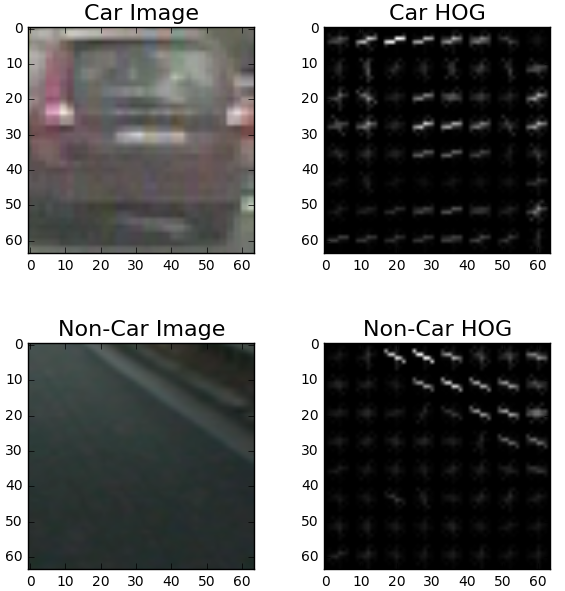

####2. Explain how you settled on your final choice of HOG parameters.

I tried various combinations of parameters and compare their consuming time. Consuming time of `YUV` is less than other colorspace when use  `All` channel of HOG. Compare with different orientation more than 7, didn't increase much time, so I just choose parameter which shown below, 
Finally i used the HOG parameters of `orientations=11`, `pixels_per_cell=(16, 16)` and `cells_per_block=(2, 2)`, `colorspace = YUV`: 

####3. Describe how (and identify where in your code) you trained a classifier using your selected HOG features (and color features if you used them).
The code for this step is contained in the 7th code cell of the file called `submit_version_final.py`.
I trained a linear SVM using Sklearn. I separated dataset (8792 images of car, 8968 images of noncar) into training and test dataset, and then label the image of car or noncar in 1 and 0, respectively. First using  `X_train` and  `y_train` to train the `clf = LinearSVC()`, and then using `X_test` and `y_test` to test the accuracy of `clf`. I just used HOG features in here.
###Sliding Window Search

####1. Describe how (and identify where in your code) you implemented a sliding window search.  How did you decide what scales to search and how much to overlap windows?
The code for this step is contained in the 8th and 14th (`process_img()`) code cell of the file called `submit_version_final.py`.
I just use half of entire image to process, because the detected target is vehicle, which just appear in below part of image. Depends on the distant between front vehicle, using different scale block to slide to search vehilce. overlap 0.5.

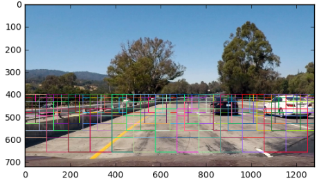
####2. Show some examples of test images to demonstrate how your pipeline is working.  What did you do to optimize the performance of your classifier?
I used 1196 images of car and 1125 images of noncar before, but get many false positive. So i try to combine more different feature to classify, such as color feature, but I met some problem in this combination step, and I don't have enough time to fix that, so I try to use more dataset to train my linear SVC classifier. Below shows a example of false positive result with less dataset, and a example of result after using more dataset.  

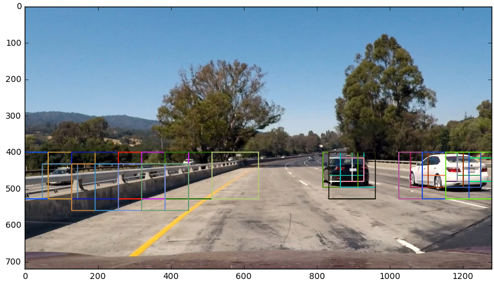
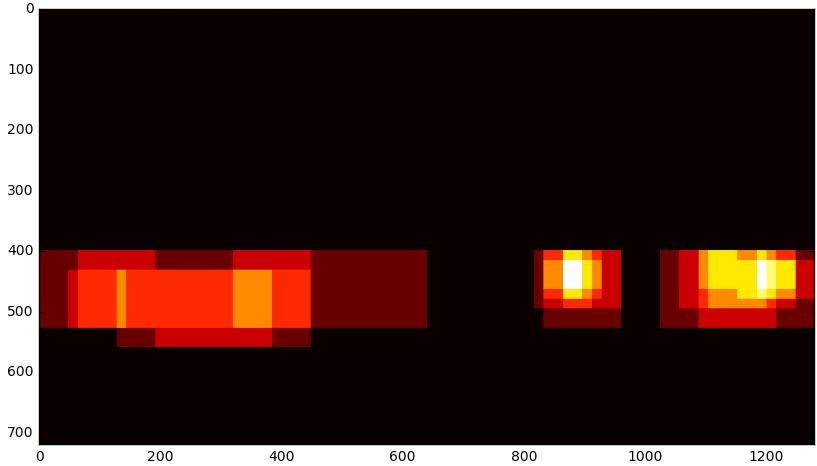
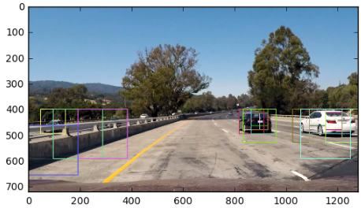
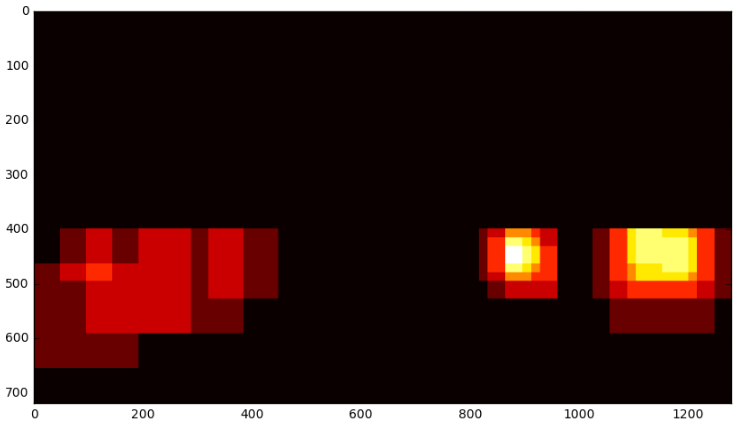
---

### Video Implementation

####1. Provide a link to your final video output.  Your pipeline should perform reasonably well on the entire project video (somewhat wobbly or unstable bounding boxes are ok as long as you are identifying the vehicles most of the time with minimal false positives.)
Here's a [link to my video result](video_out/project_video_out.mp4)

####2. Describe how (and identify where in your code) you implemented some kind of filter for false positives and some method for combining overlapping bounding boxes.

I created a heatmap and then thresholded that map to identify vehicle positions to decrease the false positives.  I then used `draw_labeled_bboxes()` to identify individual blobs in the heatmap.  I then assumed each blob corresponded to a vehicle.  I constructed bounding boxes to cover the area of each blob detected.  

### Here are six frames and their corresponding heatmaps:

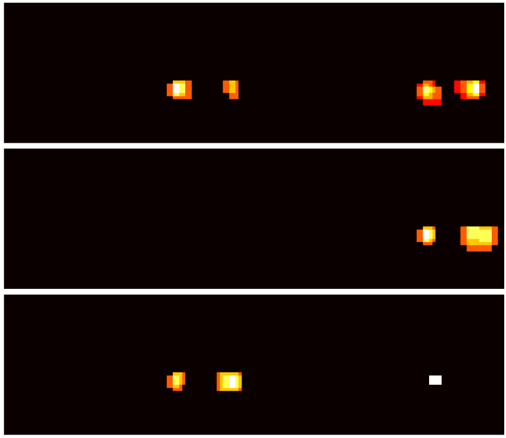

### Here is the output of `draw_labeled_bboxes()` on the integrated heatmap from all six frames:
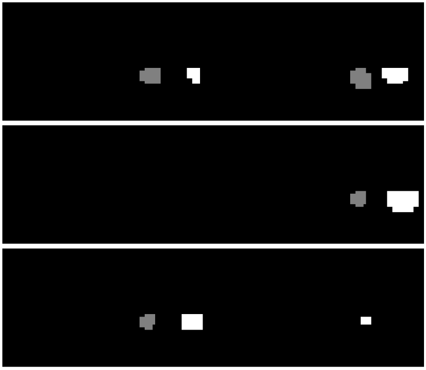

### Here the resulting bounding boxes are drawn onto the last frame in the series:
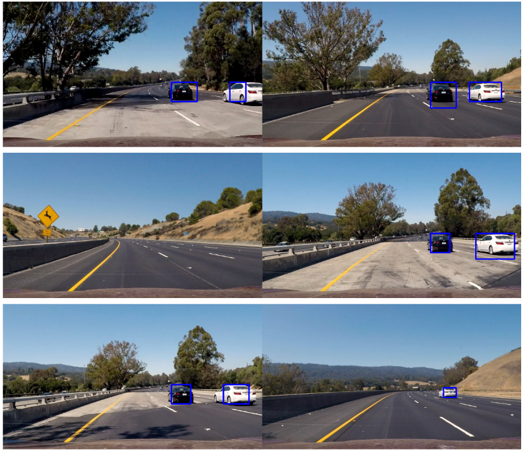

---

###Discussion

####1. Briefly discuss any problems / issues you faced in your implementation of this project.  Where will your pipeline likely fail?  What could you do to make it more robust?

From video, we can see there are false positive detection, and because of coding, the false positive detection will keep in at least 10 flames. And the second problem is that the weight and length of retangles region are not the real weight and length of vehicle, the detected precision of position and size of front vehicle are too low, but I think this shape information is really import.

After reviewer's suggestion, I use `class` to keep result of previously 10 flames , if couldn't detect rectangles at some flame. this method imporve test accuracy, reduce false positive.

I still have some problem in combining features, because of dimension of array. But I don't have enough time to fix this yet, I will fix the problem later to improve test accuracy.

